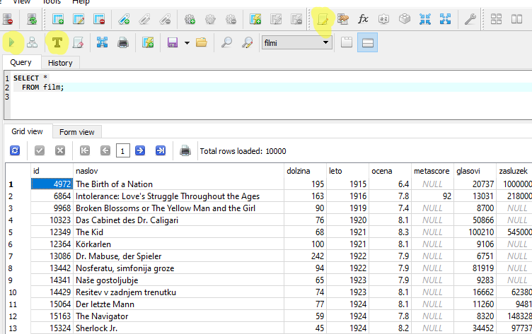

# SQL

---

# Kako do podatkov iz baze

* Vsebina tabel je uporabniku dostopna s pomočjo poizvedovalnih jezikov.
* Uveljavil se je standardni jezik **SQL** (*Structured Query Language*, strukturirani poizvedovalni jezik).
* Enostavno berljiv:
  ```sql
  SELECT tecajnica.simbol, vp.opis, tecajnica.eTecaj
    FROM tecajnica LEFT JOIN vp
         ON tecajnica.simbol = vp.simbol
   WHERE tecajnica.simbol LIKE 'Z%' AND 
         tecajnica.datum = '2004-02-26';
  ```

---

# `SELECT`

* Najpogosteje uporabljen ukaz
* Povpraševanje po podatkih
* Rezultat je tabela
  - `SELECT` torej vrne tabelo!
* Če ukaz uporabljamo v konzoli, se ta tabela izpiše.

---

# `SELECT` - osnovna struktura

`SELECT` *seznam stolpcev, ki jih želimo videti*
`FROM` *seznam tabel, kjer bomo podatke našli*
`WHERE` *pogoji, ki določajo, katere podatke želimo videti*

```sql
SELECT * FROM knjige 
 WHERE cena > 100.00
 ORDER BY naslov;
```

---

# `SELECT * FROM tabela`

* `*`
  - Izpiši vse stolpce
  - V izhodu naj bodo vsi stolpci izvorne tabele
* `tabela`
  - Ime tabele, katere stolpce želimo dobiti
* Zgledi z <http://ucisesql.fmf.uni-lj.si>
  ```sql
  SELECT * FROM drzave;
  ```

---

# SQLiteStudio

<span class="small">

* Program za delo z RDBMS [SQLite](https://www.sqlite.org/)
* Na voljo kot [samostojen program](https://sqlitestudio.pl/) ali kot [različica za nameščanje](https://github.com/pawelsalawa/sqlitestudio/releases)

   

</span>

---

# `SELECT s1, s2 FROM tabPod`

* `s1, s2`
  - V izhodno tabelo uvrsti stolpca `s1` in `s2` iz tabele `tabPod`
* Primer (<https://sqlzoo.net/wiki/SELECT_basics>):
  - Vrni ime in število prebivalcev za vsako posamezno državo
    ```sql
    SELECT name, population FROM world;

    SELECT population, name FROM world;
    ```

---

# `SELECT s1, s2 FROM tabPod` (2)

* Kaj, če v izvorni tabeli ni stolpca s tem imenom?
  - Dobimo napako.
* `AS`: poimenovanje stolpca v izhodu

  ```sql
  SELECT name AS drzava, population AS st_prebivalcev FROM world;

  SELECT name AS "Ime države" FROM world;
  ```

---

# `SELECT DISTINCT`

* V izhodno tabelo uvrsti le med seboj različne vrstice.
* Primer: vrni tabelo celin, ki nastopajo v tabeli.
  ```sql
  SELECT DISTINCT continent FROM world;
  ```
* Kaj vrneta sledeči poizvedbi?
  ```sql
  SELECT leto FROM film;

  SELECT DISTINCT leto FROM film;
  ```

---

# Poizvedba po določenih podatkih

<span class="small">

* Zanimajo nas le podatki o evropskih državah.
  ```sql
  SELECT * FROM world WHERE continent = 'Europe';
  ```
* **Konstantni nizi v enojnih narekovajih!**
* Možni relacijski operatorji:
  - `=`, `<>`, `<`, `<=`, `>`, `>=`,
  - `IS NULL`, `IS NOT NULL`,
  - `e [NOT] BETWEEN a AND b`,
  - `e [NOT] IN (v1, v2, ...)`,
  - `e [NOT] LIKE vzorec`,
  - in še kak specifičen za vsak RDBMS.
* Pogoje lahko sestavljamo z logičnimi operatorji `NOT`, `AND`, `OR`, `XOR` (in še kakimi specifičnimi za vsak RDBMS).

</span>

---

# Izrazi

* Kakšna je gostota prebivalstva vseh evropskih držav?
  ```sql
  SELECT name, population / area 
    FROM world
   WHERE continent = 'Europe';

  SELECT name AS ime_drzave,
         population / area AS gostota_prebivalstva
    FROM world
   WHERE continent = 'Europe';
  ```

* Zaokroži na dve decimalki in upoštevaj le države z več kot 2M prebivalstva.
  ```sql
  SELECT name AS "ime države", 
         ROUND(population / area, 2) AS "gostota prebivalstva" 
    FROM world
   WHERE continent = 'Europe' AND population > 2000000;
  ```

---

# Urejanje

<span class="small">

* Izhodne podatke lahko uredimo.
* Na **koncu** dodamo `ORDER BY`.
* Primer: vrni imena države in število prebivalstva, urejeno po številu prebivalcev.
  ```sql
  SELECT name, population FROM world ORDER BY population;

  SELECT name, population FROM world ORDER BY 2;

  -- Uredimo padajoče
  SELECT name, population FROM world ORDER BY population DESC;
  ```
* Uporabimo lahko tudi izraze.
  - Vrni imena evropskih držav, urejena po gostoti prebivalstva.
    ```sql
    SELECT name FROM world
     WHERE continent = 'Europe'
     ORDER BY population/area;
    ```

</span>  

---

# `SELECT` - primer

<span class="small">

```sql
SELECT name, ROUND(population/1000000) AS prebMilijoni
  FROM world
 WHERE continent IN ('Asia', 'Europe') AND
       name LIKE 'C%';
```

* Razčlenimo:
  * Izpiši ime in število prebivalcev v milijonih. 
  * Drugi stolpec poimenuj `prebMilijoni`.
  * Podatke pridobi iz tabele `world`.
  * Upoštevaj tiste vrstice, kjer je vrednost stolpca `continent` bodisi *Asia* bodisi *Europe* in kjer se vrednost v stolpcu `ime` začne s črko *C*.
* Pomen:
  - Izpiši imena in število prebivalcev tistih evropskih in azijskih držav, katerih imena se začnejo s *C*.

</span>

---

# Zahtevnejše poizvedbe

* **Izpiši imena držav, ki imajo manj prebivalcev kot Slovenija.**
* Lahko gremo po korakih
  * Najprej ugotovimo, koliko prebivalcev ima Slovenija
    ```sql
    SELECT population FROM world WHERE name = 'Slovenia';
    ```
    - Dobimo rezultat *2063151*
  * Uporabimo v ustrezni poizvedbi
    ```sql
    SELECT name FROM world WHERE population <= 2063151;
    ```
---

# S podpoizvedbami

* Kot vrednost v izrazih lahko uporabimo tudi rezultate ukaza `SELECT`
  ```sql
  SELECT name FROM world
   WHERE population <= (
           SELECT population FROM world  
            WHERE name = 'Slovenia'
         );
  ```
  * Izračunamo tabelo s stolpcem `population`, kjer upoštevamo le tiste vrstice, kjer je ime države *Slovenia*.
  * Ker ima ta tabela le eno vrstico, jo lahko uporabimo kot vrednost v zunanji poizvedbi.
* Ali bomo dobili tudi Slovenijo?

---

# Omejitve

* Podpoizvedbe naj bi vračale le en stolpec z eno vrednostjo! Drugače pride do napake.
  - Npr. če bi v našem primeru imeli dve ali več držav z imenom *Canada*.
* Z nekaterimi operatorji lahko podpoizvedba vrača tudi več vrstic.
  - `e [NOT] IN (SELECT ... )` - ali je (ni) vrednost `e` ena izmed vrednosti v stolpcu
  - `e < ALL (SELECT ...)` - ali je vrednost `e` manjša od vseh vrednosti v stolpcu
  - `e >= ANY (SELECT ...)` - ali je vrednost `e` večja ali enaka vsaj eni vrednosti v stolpcu
  - `[NOT] EXISTS (SELECT ...)` - ali podpoizvedba vrne vsaj eno vrstico (oz. nobene)

---

# Primer

<span class="small">

* [Tabela](https://sqlzoo.net/wiki/SELECT_from_Nobel_Tutorial): `nobel(yr, subject, winner)`
* Izpiši leta, kjer je bila podeljena Nobelova nagrada za fiziko in ne za kemijo.
* Kako?
  - Upoštevamo vrstice, kjer velja `subject = 'physics'`.
  - Izločimo vrstice, kjer je vrednost v stolpcu `yr` ena od tistih vrednosti, ki nastopajo v stolpcu `yr` pri tistih vrsticah, kjer je `subject = 'chemistry'`.
* ```sql
  SELECT DISTINCT yr FROM nobel
   WHERE subject = 'physics' AND
         yr NOT IN (
           SELECT yr FROM nobel
            WHERE subject = 'chemistry'
         );
  ```
* Zakaj `DISTINCT`?
  - Lahko je več dobitnikov za fiziko v istem letu!

</span>

---

# `WITH`

<span class="small">

* Zanimajo nas filmi, ki so dobili enake ocene kot Filmi, da te kap.
  ```sql
  SELECT naslov, ocena FROM film 
   WHERE ocena IN (
           SELECT ocena FROM film 
            WHERE naslov LIKE 'Scary Movie%' OR
                  naslov = 'Film da te kap'
         );
  ```
* Z določilom `WITH` si lahko pripravimo podpoizvedbo in se nanjo sklicujemo z določenim imenom.
  ```sql
  WITH ocene_strasnih_filmov AS (
    SELECT ocena FROM film
     WHERE naslov LIKE 'Scary Movie%' OR 
           naslov = 'Film da te kap'
  )
  SELECT naslov, ocena FROM film
   WHERE ocena IN ocene_strasnih_filmov;
  ```

</span>

---

# Združevalne funkcije

* `SUM(stolpec)`: vsota vrednosti v stolpcu
  - Koliko "proizvedemo" v Evropi:
    ```sql
    SELECT SUM(gdp) FROM world
     WHERE continent = 'Europe';
    ```
* `AVG(stolpec)`: povprečna vrednost v stolpcu
  - Povprečno število prebivalcev v Evropi:
    ```sql
    SELECT AVG(population) FROM world
     WHERE continent = 'Europe';
    ```
---

# Združevalne funkcije (2)

* `MIN(stolpec)`: minimalna vrednost v stolpcu
  - Najmanjša površina, ki jo ima neka država v tabeli:
    ```sql
    SELECT MIN(area) FROM world;
    ```
* `MAX(stolpec)`: maksimalna vrednost v stolpcu
  - Največje število prebivalcev izmed držav v Afriki:
    ```sql
    SELECT MAX(population) FROM world
     WHERE continent = 'Africa';
    ```
* Funkcije `SUM`, `AVG`, `MIN`, `MAX` upoštevajo le vrednosti, ki niso `NULL`!

---

# Združevalne funkcije (3)

* `COUNT(stolpec)`: število vrstic z neničelno vrednostjo v stolpcu
  - Število filmov z določeno oznako (podatek je v tabeli):
    ```sql
    SELECT COUNT(oznaka) FROM film;
    ```
* `COUNT(DISTINCT stolpec)`: število različnih vrednosti v stolpcu
  - Število različnih oznak, ki se pojavijo:
    ```sql
    SELECT COUNT(DISTINCT oznaka) FROM film;
    ```
* `COUNT(*)`: število vrstic (zapisov)
  - Število ameriških držav v tabeli (J. in S. Amerika):
    ```sql
    SELECT COUNT(*) FROM world
     WHERE continent LIKE '%America%';
    ```

---

# Zgled

* Izpišimo seznam afriških držav, katerih ime se začne na *S*, je sestavljeno le iz ene besede in ni *Senegal*.
  ```sql
  SELECT * FROM world
   WHERE name LIKE 'S%' AND
         continent = 'Africa' AND
         name NOT LIKE '% %' AND
         name <> 'Senegal';
  ```
* Kakšen je povprečni GDP teh držav?
  ```sql
  SELECT AVG(gdp) FROM world
   WHERE name LIKE 'S%' AND
         continent = 'Africa' AND
         name NOT LIKE '% %' AND
         name <> 'Senegal';
  ```

---

# Združevalne funkcije in težave

* Zanima nas naslov filma z najkrajšim naslovom.
  ```sql
  SELECT naslov, MIN(LENGTH(naslov)) FROM film;
  ```
  - Dobimo eno vrstico.
* Je to prav? Je to edini tak film?
  ```sql
  SELECT naslov, LENGTH(naslov) AS dolzina FROM film
  ORDER BY dolzina;
  ```
* Prejšnja poizvedba ni v skladu s standardom SQL!
  - Čeprav jo SQLite dovoli ...

---

# Združevalne funkcije in težave (2)

* Poskusimo podobno na SQLZoo.
  ```sql
  SELECT name, MAX(population) FROM world
   WHERE continent = 'Africa';
  ```
* Dobimo napako, npr.
  ```
  Mixing of GROUP columns (MIN(),MAX(),COUNT(),...) with no
  GROUP columns is illegal if there is no GROUP BY clause
  ```
* Kaj pravzaprav zahtevamo od RDBMS?
  - Dobiti želimo vsa imena afriških držav
  - in še največje prebivalstvo med njimi.
  - To ne bo šlo, saj želimo imeti en stolpec z več vrsticami in enega z eno samo!

---

# Združevalne funkcije in težave (3)

* Kaj pa takole?
  ```sql
  SELECT name, population FROM world
   WHERE continent = 'Africa' AND
         population = MAX(population);
  ```
* Združevalnih funkcij ne moremo uporabiti pri `WHERE`, saj tukaj preverjamo pogoje na eni vrstici naenkrat!

---

# Združevalne funkcije in težave (4)

* Rešitev?
* S podpoizvedbo:
  ```sql
  SELECT name, population FROM world
   WHERE continent = 'Africa' AND
         population = (
           SELECT MAX(population) FROM world
            WHERE continent = 'Africa'
         );
  ```

---

# Še en zgled

* Poišči imena tistih držav, ki imajo bruto družbeni proizvod večji od katerekoli evropske države.
* Spet uporabimo podpoizvedbo:
  ```sql
  SELECT name FROM world 
   WHERE gdp > (
           SELECT MAX(gdp) FROM world 
            WHERE continent = 'Europe'
         );
  ```
* Naša poizvedba se bere tako:
  - Poišči imena tistih držav, ki imajo bruto družbeni proizvod večji od največjega GDP evropskih držav.

---

# Še en zgled (2)

* Ali lahko napišemo poizvedbo, ki se bo brala tako, kot smo vprašali?
* Če za relacijskim operatorjem uporabimo določilo `ALL`, mora biti pogoj izpolnjen za vse rezultate podpoizvedbe.
  ```sql
  SELECT name FROM world 
   WHERE gdp > ALL (
           SELECT gdp FROM world 
            WHERE continent = 'Europe'
         );
  ```
  - <small>SQLite tega **ne** podpira!</small>
* Kaj pa, če je med rezultati podpoizvedbe `NULL`?
  
---

# Primerjanje z `NULL`

* Operacije z `NULL` vračajo `NULL`!
* Izjema: `IS [NOT] NULL`:
  ```sql
  SELECT name FROM world 
   WHERE gdp > ALL (
           SELECT gdp FROM world 
            WHERE continent = 'Europe' AND
                  gdp IS NOT NULL
         );
  ```

---

# In sedaj nekaj zapletenega

* Izpiši ime, celino in število prebivalcev vseh tistih držav, ki so na celini, kjer ima vsaka država manj kot 30M prebivalcev.
* Gremo po delčkih.
  - Osnovni `SELECT` bo enostaven:
    ```sql
    SELECT name, continent, population FROM world
     WHERE continent IN (
             -- seznam ustreznih celin
           );
    ```

---

# Kako dobiti seznam celin

* Kako preveriti, ali imajo vse države na določeni celini manj kot 30M prebivalcev?
* Poskusimo z `MAX` za Evropo.
  ```sql
  SELECT continent FROM world
   WHERE 30000000 > (
           SELECT MAX(population) FROM world
            WHERE continent = 'Europe'
         );
  ```
* Dobimo prazno tabelo.
  - Prav, saj ima največja evropska država 80M prebivalcev.
  - Za nobeno vrstico pogoj ni izpolnjen.

---

# Ustrezna celina

* "Ročno" preverimo, da je taka celina *Oceania*.
* Torej bi moralo biti tole v redu za vse države v Oceaniji.
  ```sql
  SELECT continent FROM world
   WHERE 30000000 > (
           SELECT MAX(population) FROM world
            WHERE continent = 'Oceania'
         );
  ```
* Dobimo ogromno tabelo!
  - Če uporabimo `COUNT`, vidimo, da dobimo VSE države (195).
  - Za vsako vrstico je pogoj izpolnjen!
* Hočemo, da sta celini "zunaj" in "znotraj" enaki.

---

# Kombiniranje notranje in zunanje poizvedbe

* Poglejmo si to poizvedbo:
  ```sql
  SELECT continent, name, population FROM world AS t1
   WHERE population >= ALL (
           SELECT population FROM world AS t2
            WHERE t1.continent = t2.continent
         );
  ```
* Kaj pomeni `world AS t1`?
  - Tabelo `world` smo preimenovali v `t1`.
  - Sedaj lahko torej uporabimo ime `t1` za sklicevanje na tabelo `world` iz zunanje poizvedbe.
  - `t1.continent`: stolpec `continent` iz tabele `t1`.

---

# Kombiniranje notranje in zunanje poizvedbe (2)

* Imamo torej dve kopiji tabele `world`:
  - `t1` v zunanji poizvedbi, in
  - `t2` v podpoizvedbi.
* Lahko si predstavljamo, da imamo dvojno zanko čez vrstice tabele `world`:
  - `t1` se nanaša na trenutno vrstico v zunanji zanki,
  - `t2` se nanaša na trenutno vrstico v notranji zanki.
* Dobimo torej države z največjim številom prebivalcev na vsaki celini.

---

# Ustrezna celina (2)

* Poskusimo torej:
  ```sql
  SELECT continent FROM world AS t1
   WHERE 30000000 > ALL (
           SELECT population FROM world AS t2
            WHERE t1.continent = t2.continent
         );
  ```
* Dobimo vrstico za vsako državo na ustrezni celini.
  - Lahko bi uporabili `DISTINCT`, saj nas zanima samo seznam celin.

---

# Končna rešitev

```sql
SELECT name, continent, population FROM world
 WHERE continent IN (
         SELECT continent FROM world AS t1
          WHERE 30000000 > ALL (
                  SELECT population FROM world AS t2
                   WHERE t1.continent = t2.continent
                )
       );
```

* Bi šlo enostavneje?
  ```sql
  SELECT name, continent, population FROM world AS t1
   WHERE 30000000 > ALL (
           SELECT population FROM world AS t2
            WHERE t1.continent = t2.continent
         );
  ```

---

# Združevalne funkcije in skupine podatkov

* Denimo, da nas zanima maksimalno število prebivalcev države na vsaki celini.
* To lahko naredimo s podpoizvedbo:
  ```sql
  SELECT continent, population FROM world AS t1
   WHERE population >= ALL (
           SELECT population FROM world AS t2
            WHERE t1.continent = t2.continent
         );
  ```
* Težava: delamo dvojno zanko.
  - Ali bi znali sprogramirati brez gnezdenja zank?

---

# `GROUP BY`


```sql
SELECT ... FROM tabela
...
GROUP BY stolpci;
```

* Vrstice v tabeli razdelimo v skupine glede na navedene stolpce oziroma izraze.
* Združevalne funkcije potem delujejo za vsako skupino posebej.
  - Poizvedba vrne toliko vrstic, kolikor je skupin.

---

# `GROUP BY` - primer

<span class="small columns" style="--cols: 3;">
<span>

```sql
SELECT ... FROM donacije;
```

Ime   | Prispevek
----- | ---------
Anja  | 25
Janez | 62
Anja  | 60
Špela | 390
Špela | 25

</span>
<span>

```sql
SELECT ... FROM donacije
 GROUP BY ime;
```

Ime   | Prispevek
----- | ---------
Anja  | 25
Anja  | 60
&nbsp; | &nbsp;
Janez | 62
&nbsp; | &nbsp;
Špela | 390
Špela | 25

</span>
<span>

```sql
SELECT ... FROM donacije
 GROUP BY prispevek/100;
```

Ime   | Prispevek
----- | ---------
Anja  | 25
Anja  | 60
Janez | 62
Špela | 25
&nbsp; | &nbsp;
Špela | 390

</span>
</span>

---

# Primer

* Maksimalno število prebivalcev države na vsaki celini z `GROUP BY`:
  ```sql
  SELECT MAX(population) FROM world
   GROUP BY continent;
  ```
* Zanimajo nas tudi celine, ki jim pripadajo dobljene številke.
  ```sql
  SELECT continent, MAX(population) FROM world
   GROUP BY continent;
  ```

---

# Izbor stolpcev

```sql
SELECT ime, prispevek FROM donacije GROUP BY ime;

SELECT ime, prispevek FROM donacije GROUP BY prispevek / 100;
```

* Zgornja stavka nista v skladu s standardom SQL!
* Če uporabimo `GROUP BY`, bo v izhodu **ena** vrstica za vsako skupino.
* Standard prepoveduje uporabo stolpcev, ki niso navedeni pri `GROUP BY`, izven združevalnih funkcij.
* Kaj točno se zgodi ob izvedbi zgornjih stavkov, je odvisno od RDBMS.

---

# Napake

```sql
SELECT name, continent, MAX(population) FROM world
 GROUP BY continent;
```

* Zakaj to ni OK?
* SQLZoo vrne
  ```
  Expression #1 of SELECT list is not in GROUP BY clause
  and contains nonaggregated column 'gisq.world.name'
  which is not functionally dependent on columns in GROUP BY clause;
  this is incompatible with sql_mode=only_full_group_by
  ```

---

# `GROUP BY` in `WHERE`

<span class="columns" style="--cols: 2;">
<span>

* Zanima nas število držav z vsaj 160M prebivalci na vsaki celini.
* Takih držav je 7:
  
  ```sql
  SELECT name, population FROM world
   WHERE population >= 160000000;
  ```

</span>
<span>

* Dobimo:
  
  `name`        | `population`
  ------------- | ------------
  Brazil        | 202794000
  China         | 1365370000
  India         | 1246160000
  Indonesia     | 252164800
  Nigeria       | 178517000
  Pakistan      | 188020000
  United States | 318320000

</span>
</span>

---

# `GROUP BY` in `WHERE` (2)

```sql
SELECT continent, COUNT(*) AS stevilo FROM world 
 WHERE population >= 160000000
 GROUP BY continent;
```

<span class="columns" style="--cols: 2;">
<span>

`continent`   | `stevilo`
------------- | ---------
Africa        | 1
Asia          | 4
North America | 1
South America | 1

</span>
<span>

* `WHERE` deluje **pred** združevanjem.
* Zato smo najprej dobili tabelo s 7 vrsticami.
* Te smo potem z `GROUP BY` razdelili v skupine po celinah.
* `COUNT` pa je potem preštel število vrstic v posamezni skupini.

</span>
</span>

---

# Filtriranje skupin

* Zanimajo nas tiste celine, na katerih živi vsaj 500M prebivalcev.
* Šlo bi brez uporabe `GROUP BY`:
  ```sql
  SELECT DISTINCT continent FROM world AS t1
   WHERE 500000000 <= (
           SELECT SUM(population) FROM world AS t2
            WHERE t1.continent = t2.continent
         );
  ```
  - Spet delamo dvojno zanko!

---

# Filtriranje skupin (2)

* Poskusimo še z `GROUP BY`.
* Izpišimo najprej prebivalstvo vsake celine.
  ```sql
  SELECT continent, SUM(population) FROM world
   GROUP BY continent;
  ```
* Ali lahko uporabimo `WHERE`?
  * Ne - ta deluje pred združevanjem!

---

# `GROUP BY` in `HAVING`

* Z določilom `HAVING` filtriramo skupine, nastale pri združevanju.
  ```sql
  SELECT continent FROM world
   GROUP BY continent
  HAVING SUM(population) >= 500000000;
  ```
  - Najprej tabelo razdelimo na skupine po celinah.
  - `SUM(population)` potem seštejo prebivalstvo na posamezni celini.
  - Pogoj pri `HAVING` preverja vrstice, ki jo dobimo za vsako skupino.
* Pri `HAVING` smemo uporabiti tiste stolpce/izraze, ki jih lahko ob uporabi `GROUP BY` izberemo za stolpce dobljene tabele.

---

# Več ključev

* Pri `GROUP BY` lahko uporabimo tudi več stolpcev (ključev).
  
  <span class="small">

  Ime    | Starost | Kraj
  ------ | ------- | ---------
  Janez  | 18      | Kranj
  Metka  | 18      | Kranj
  Peter  | 20      | Kranj
  Pavel  | 21      | Ljubljana
  Ivana  | 18      | Ljubljana
  Silva  | 19      | Ljubljana
  Srečko | 20      | Celje

  ```sql
  SELECT ... FROM t GROUP BY starost;       -- 4 skupine
  SELECT ... FROM t GROUP BY kraj;          -- 3 skupine
  SELECT ... FROM t GROUP BY starost, kraj; -- 6 skupin
  ```

  </span>

---

# Zgled

* Prikaži tista leta in področja, kjer so bile v istem letu podeljene 3 nagrade ali več. Upoštevaj le leta po letu 2000.
* Skupino sestavlja par (leto, področje).
  - `GROUP BY yr, subject`
  - ali `GROUP BY subject, yr`
* Z `WHERE yr > 2000` bomo omejili leta.
* S `HAVING COUNT(*) >= 3` bomo upoštevali le skupine z vsaj tremi vrsticami.
  ```sql
  SELECT yr, subject FROM nobel
   WHERE yr > 2000
   GROUP BY yr, subject
  HAVING COUNT(*) >= 3
   ORDER BY yr;
  ```

---

# Stikanje tabel

<span class="columns small" style="--cols: 2;">
<span>

* Denimo, da imamo sledeči tabeli o olimpijskih igrah.


  Leto | Kraj
  ---- | -------
  1896 | Atene
  1948 | London
  2004 | Atene
  2008 | Beijing
  2012 | London

  Kraj    | Država
  ------- | ----------------
  Atene   | Grčija
  London  | Velika Britanija
  Beijing | Kitajska

</span>
<span>

* V kateri državi so bile OI leta 2004?
* Za vsako državo nas zanima, kolikokrat je priredila OI.
* Da odgovorimo, potrebujemo podatke **obeh** tabel.

  Leto | Kraj    | Država
  ---- | ------- | ----------------
  1896 | Atene   | Grčija
  1948 | London  | Velika Britanija
  2004 | Atene   | Grčija
  2008 | Beijing | Kitajska
  2012 | London  | Velika Britanija

</span>
</span>

---

# Stikanje tabel (2)

- Seveda moramo računati na nepopolne podatke ...

<span class="columns" style="--cols: 2;">
<span>

  <span class="small">

  Leto | Kraj
  ---- | -------
  1896 | Atene
  1948 | London
  2004 | Atene
  2008 | Beijing
  2012 | London

  Kraj   | Država
  ------ | ----------------
  Atene  | Grčija
  London | Velika Britanija
  Sydney | Avstralija

  </span>

</span>
<span>

Leto   | Kraj    | Država
------ | ------- | ----------------
1896   | Atene   | Grčija
1948   | London  | Velika Britanija
2004   | Atene   | Grčija
2008   | Beijing |
2012   | London  | Velika Britanija
&nbsp; | Sydney  | Avstralija

</span>
</span>

---

# `SELECT` in več tabel

* "Prave" baze torej običajno sestavlja več tabel.
* Pogosto želimo kot rezultat dobiti podatke, ki se nahajajo v več tabelah.

  <span class="columns small" style="--cols: 2;">
  <span>

  `ID` | `ImePriimek` | `Posta`
  ---- | ------------ | -------
  MK1  | Miha Kranjc  | 1000
  MH1  | Maja Hrust   | 2000
  LS1  | Lidija Svet  | 1000
  MK2  | Mitja Kern   | 3000

  `Posta` | `Kraj`
  ------- | ---------
  1000    | Ljubljana
  2000    | Maribor
  3000    | Celje

  </span>
  <span>

  `ID` | `ImePriimek` | `Posta` | `Kraj`
  ---- | ------------ | ------- | ---------
  MK1  | Miha Kranjc  | 1000    | Ljubljana
  MH1  | Maja Hrust   | 2000    | Maribor
  LS1  | Lidija Svet  | 1000    | Ljubljana
  MK2  | Mitja Kern   | 3000    | Celje

  </span>
  </span>

---

# Kartezični produkt

* Navedemo lahko več tabel:
  ```sql
  SELECT * FROM zaposleni, posta;
  ```
* Dobimo kartezični produkt, torej $mn$ zapisov (kjer sta $m$ in $n$ števili zapisov v prvi in drugi tabeli).
  - V primeru zaposlenih: $4 \cdot 3 = 12$ zapisov!
  - Kot da bi vsak živel v *vsakem* kraju!
* Včasih je to čisto smiselno!
  - Seznam deklet
  - Seznam fantov
  - Kartezični produkt: možni pari

---

# Sklicevanje na stolpce

* Kako do določenih stolpcev?
  ```sql
  SELECT ImePriimek, Posta, Kraj FROM zaposleni, posta;
  ```
* Od kod dobimo vrednost stolpca `Posta`?
  - Če imamo tak stolpec v več tabelah, dobimo napako!
* Navedemo lahko, iz katere tabele naj bo nek stolpec:
  ```sql
  SELECT ImePriimek, posta.Posta, Kraj FROM zaposleni, posta;
  ```
  - Torej `tabela.stolpec`.
  - Če ni možnosti za zmedo (ime stolpca se pojavi le v eni od navedenih tabel), lahko ime tabele izpustimo.

---

# Stikanje z omejevanjem

<span class="small">

* Izberimo samo zapise, kjer se poštni številki ujemata:
  ```sql
  SELECT * FROM zaposleni, posta
  WHERE zaposleni.Posta = posta.Posta;
  ```
* Ker smo uporabili `*`, dobimo vse stolpce iz obeh tabel.
  
  `ID` | `ImePriimek` | `Posta` | `Posta` | `Kraj`
  ---- | ------------ | ------- | ------- | ---------
  MK1  | Miha Kranjc  | 1000    | 1000    | Ljubljana
  MH1  | Maja Hrust   | 2000    | 2000    | Maribor
  LS1  | Lidija Svet  | 1000    | 1000    | Ljubljana
  MK2  | Mitja Kern   | 3000    | 3000    | Celje

  - Stolpec `Posta` dobimo iz obeh tabel!

</span>

---

# Izbor določenih vrednosti

* Denimo, da nas zanimajo podatki o točno določenem zaposlenem.
  ```sql
  SELECT * FROM zaposleni, posta
   WHERE zaposleni.Posta = posta.Posta AND
         ID = 'MK1';
  ```
* Pogoji v `WHERE`:
  - preverjanje ujemanja vrstic (`zaposleni.Posta = posta.Posta`)
  - vsebinsko filtriranje rezultatov (`ID = 'MK1'`)
* Želimo ločiti filtriranje zaradi vsebine in zaradi stikanja!

---

# Notranji stik (`INNER JOIN`)

* Zaradi preglednosti lahko ločimo obe vrsti filtriranja:
  ```sql
  SELECT * FROM zaposleni
   INNER JOIN posta
           ON zaposleni.Posta = posta.Posta
   WHERE ID = 'MK1';
  ```
  - Določilo `INNER` lahko izpustimo.
* Če obstajajo vrstice, za katere pogoj za stikanje ni nikoli resničen (npr. neke poštne številke zaposlenega ni v tabeli `posta`), teh vrstic ne bo v izhodu!

---

# Zunanji stik (`OUTER JOIN`)

* Želimo dobiti tudi vrstice iz prve tabele, ki nimajo para v drugi tabeli (in/ali obratno).
  ```sql
  SELECT * FROM oi
    LEFT OUTER JOIN kraj
                 ON oi.kraj = kraj.kraj;
  ```
  - `LEFT [OUTER] JOIN` - ohrani vse vrstice iz prve tabele
  - `RIGHT [OUTER] JOIN` - ohrani vse vrstice iz druge tabele
  - `FULL [OUTER] JOIN` - ohrani vse vrstice iz obeh tabel
* Vrstice, za katere pogoj pri `ON` ni nikoli izpolnjen, se ohranijo, vrednosti v stolpcih iz druge tabele pa dobijo vrednosti `NULL`.
* Filtriranje z `WHERE` se zgodi po stikanju (in lahko izloči prej ohranjene vrstice).

---

# Druge možnosti stikanja

* Pogoj pri `ON` je lahko poljuben (ne nujno ujemanje po stolpcih)!
* Če stikamo po istoimeskih stolpcih, lahko namesto pogoja pri `ON` naštejemo stolpce z določilom `USING`:
  ```sql
  SELECT * FROM zaposleni
   INNER JOIN posta USING (Posta);
  ```
  - Če stikamo po več stolpcih, jih naštejemo med oklepaji, ločene z vejicami.
  - Našteti stolpci se v izhodu **ne** podvojijo!
* Če stikamo po *vseh* istoimeskih stolpcih, lahko uporabimo `NATURAL JOIN`:
  ```sql
  SELECT * FROM oi
  NATURAL LEFT OUTER JOIN kraj;
  ```

---

# Ustvarjanje baz

```sql
CREATE DATABASE baza;
```

* Moramo imeti ustrezne pravice na RDBMS!
* V SQLite ta korak ni potreben - baza se ustvari kot datoteka.

---

# Ustvarjanje tabel

```sql
CREATE TABLE tabela (
  stolpec1 tip
    [PRIMARY KEY]                       -- glavni ključ
    [NOT NULL]                          -- prepovedana vrednost NULL
    [UNIQUE]                            -- enolične vrednosti v stolpcu
    [CHECK (pogoj)]                     -- pogoj, ki mora veljati za stolpec
    [DEFAULT (vrednost)]                -- privzeta vrednost
    [REFERENCES druga_tabela(stolpec)], -- tuji ključ
  [PRIMARY KEY (st1, st2, ...),]        -- glavni ključ iz več stolpcev
  [UNIQUE (st1, st2, ...),]             -- enolične vrednosti v več stolpcih
  [CHECK (pogoj),]                      -- pogoj, ki vključuje več stolpcev
  [FOREIGN KEY (st1, st2, ...)          -- tuji ključ iz več stolpcev
     REFERENCES druga_tabela(s1, s2, ...),]
  ...
);
```

* Različni RDBMS poznajo še druga določila, npr. `AUTOINCREMENT` pri SQLite.

---

# Podatkovni tipi

* Številski tipi:
  - `integer` ipd. - cela števila
  - `numeric(p, s)`, `decimal(p, s)`, `real`, ... - decimalna števila
* Besedilni tipi:
  - `char(n)`, `varchar(n)` - nizi dolžine natanko/največ `n` znakov
  - `text` - poljubno besedilo
* Časovni tipi (oblika [ISO 8601](https://en.wikipedia.org/wiki/ISO_8601)):
  - `date` - datum v obliki `YYYY-MM-DD`
  - `time` - čas v obliki `hh:mm:ss`
  - `datetime` - datum in čas v obliki `YYYY-MM-DD hh:mm:ss`
* Detajli se razlikujejo med različnimi RDBMS.

---

# Omejitve

* RDBMS lahko ob spreminjanju podatkov v bazi preverja, ali držijo omejitve, predpisane ob ustvarjanju tabele.
  - Če ne držijo, ne dovoli zaključka transakcije.
* `PRIMARY KEY` (glavni ključ) - stolpec (ali več njih), katerega vrednost enolično določa vrstico.
  - Lahko je samo en!
  - Vrednosti se ne smejo ponavljati in ne smejo biti `NULL`.
* `NOT NULL` - vrednosti v stolpcu morajo obstajati (niso `NULL`).
* `UNIQUE` (enoličnost) - vrednosti v stolpcu (ali več njih) se ne smejo ponavljati.
  - Vrednost `NULL` se lahko pojavi tudi večkrat (če ni prepovedana z `NOT NULL`)!

---

# Omejitve (2)

* `CHECK` - pogoj, ki mora veljati v vsaki vrstici tabele.
* `FOREIGN KEY`/`REFERENCES` - tuji ključ oz. referenca na drugo tabelo.
  - V stolpcu (ali več njih) se smejo pojaviti samo tiste vrednosti, ki se pojavijo kot vrednosti v stolpcu (ali več njih) tabele, na katero se sklicujemo.
  - Lahko se pojavijo tudi vrednosti `NULL` (če niso prepovedane z `NOT NULL`).
* Mogoče je nastaviti (odvisno od RDBMS), kaj se zgodi ob kršitvi omejitve.
  - Za tuje ključe je mogoče določiti tudi, kdaj se preverijo - takoj ali ob koncu transakcije.

---

# Privzete vrednosti

* Včasih so določene vrednosti stolpca zelo pogoste.
  - Primer: število kosov artikla ob dodajanju v košarico je 1.
  - Še en primer: ob dodajanju v tabelo naj se zapiše trenutni čas.
* Če pri vstavljanju podatka ne navedemo, se uporabi privzeta vrednost.
* Poseben primer: avtomatsko številčenje.
  - V SQLite uporabimo določilo `AUTOINCREMENT` takoj za `PRIMARY KEY` pri stolpcu tipa `ìnteger`.
  - Nekateri RDBMS v ta namen uporabijo števce.

---

# Primer (SQLite)

```sql
CREATE TABLE kupec (
  id_kupec        integer  PRIMARY KEY AUTOINCREMENT,
  uporabnisko_ime text     NOT NULL UNIQUE,
  ime             text     NOT NULL,
  priimek         text     NOT NULL,
  naslov          text,
  datum_rojstva   date     CHECK (datum_rojstva < DATETIME('now', '-18 years')),
                           -- kupec mora biti starejši od 18 let
  CHECK (LENGTH(ime) + LENGTH(priimek) <= 30)
);

CREATE TABLE narocilo (
  id_narocilo     integer  PRIMARY KEY AUTOINCREMENT,
  id_kupec        integer  NOT NULL REFERENCES kupec(id_kupec),
  stevilo         integer  DEFAULT (1),
  datum           datetime DEFAULT (DATETIME('now'))
);
```

---

# Vstavljanje podatkov

```sql
INSERT INTO tabela [(stolpec1, stolpec2, ...)]
VALUES (vrednost1, vrednost2, ...), ...;
```

* Za vsak naveden nabor vstavi **eno** vrstico v navedeno tabelo.
  - Obstoječe vrstice ostanejo nespremenjene.
* Vstavljene vrstice bodo imele v naštetih stolpcih ustrezne naštete vrednosti.
  - Če kateri od stolpcev tabele ni naštet, se uporabi njegova privzeta vrednost oziroma `NULL`.
* Če stolpcev ne naštejemo, se smatra, da smo našteli vse stolpce v vrstnem redu iz definicije tabele.

---

# Vstavljanje izpeljanih podatkov

```sql
INSERT INTO tabela [(stolpec1, stolpec2, ...)]
SELECT ...;
```

* V navedeno tabelo vstavimo vrstice iz rezultata navedenega stavka `SELECT`.
  - Rezultat mora imeti ustrezno število stolpcev!
* Stavek `SELECT` je lahko poljuben (`WHERE`, `JOIN`, `GROUP BY`, `WITH`, ...).

---

# Primeri

```sql
INSERT INTO kupec (uporabnisko_ime, ime, priimek, datum_rojstva)
VALUES ('janez', 'Janez', 'Novak', '1978-03-24'); -- dobi id_kupec = 1

INSERT INTO kupec (uporabnisko_ime, ime, priimek, datum_rojstva)
VALUES ('micka', 'Micka', 'Kovač', '2008-07-11'); -- napaka!

INSERT INTO kupec (uporabnisko_ime, ime, priimek, datum_rojstva)
VALUES ('micka', 'Micka', 'Kovač', '1998-07-11'); -- dobi id_kupec = 2

INSERT INTO narocilo (id_kupec)
SELECT id_kupec FROM kupec
 WHERE priimek = 'Novak';  -- ena vrstica, dobi id_narocilo = 1

INSERT INTO narocilo (id_kupec, stevilo)
VALUES (1, 3), (2, 4), (2, 2), (3, 6), (1, 5); -- napaka!

INSERT INTO narocilo (id_kupec, stevilo)
VALUES (1, 3), (2, 4), (2, 2), (1, 5); -- dobijo id_narocilo = 2, 3, 4, 5
```

---

# Spreminjanje obstoječih podatkov

```sql
UPDATE tabela
   SET stolpec1 = vrednost1, stolpec2 = vrednost2, ...
 WHERE pogoj;
```

* Spreminjamo obstoječe vrstice v navedeni tabeli - njihovo število ostane nespremenjeno.
* Pogoj `WHERE` določa, katere vrstice bomo spremenili.
  - Lahko ga izpustimo - tedaj spreminjamo vse vrstice.
* S `SET` povemo, kako spremenimo stolpce v izbranih vrsticah.
  - Vrednosti lahko sestavimo iz obstoječih vrednosti v trenutni vrstici.

---

# Brisanje podatkov

```sql
DELETE FROM tabela
 WHERE pogoj;
```

* Iz navedene tabele pobrišemo vrstice, ki ustrezajo pogoju.
* Če izpustimo `WHERE`, bomo pobrisali vse vrstice!

---

# Primeri

```sql
UPDATE narocilo
   SET stevilo = stevilo - 1
 WHERE id_kupec = 1;

DELETE FROM narocilo
 WHERE stevilo < 1;
```

---

# Transakcije

* Začetek transakcije:
  ```sql
  BEGIN [TRANSACTION];
  ```
* Potrditev transakcije:
  ```sql
  END [TRANSACTION];
  COMMIT;
  ```
* Preklic transakcije:
  ```sql
  ROLLBACK;
  ```

---

# Spremembe in transakcije

* Spomnimo: ko se transakcija uspešno zaključi, so nastale spremembe stalne.
  - Nimamo možnosti razveljavitve!
* Če ne poskrbimo za kontrolo transakcij, šteje vsak stavek `INSERT`/`UPDATE`/`DELETE` kot ena transakcija.
* Posledica: spremenjenih in pobrisanih vrstic ne bomo mogli vedno povrniti!
  - Če še nismo zaključili transakcije, jo lahko prekličemo in se tako vrnemo na prvotno stanje.
* Če med izvajanjem stavka pride do kakršnekoli napake, ostane stanje nespremenjeno.
