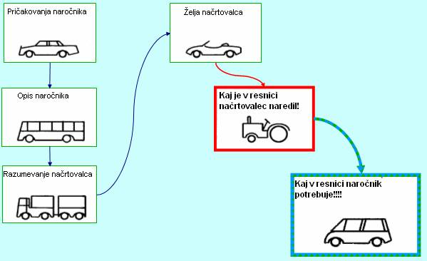

# Načrtovanje podatkovnih baz

* Načrtovanje podatkovne baze je postopek opredelitve in razvoja strukture podatkovne baze.
  - Formalni model nekaterih vidikov realnega sveta (problemske domene)
* Mera za pravilnost načrtovane sheme podatkovne baze je realni svet.
  - Od tod sledi, da mora vsebina podatkovne baze odražati podatke, pravila in izjeme iz realnega sveta.

  

---

# Zgradba/arhitektura podatkovnih baz

Zgradbo podatkovnih baz opisuje trinivojska arhitektura [ANSI-SPARC](https://en.wikipedia.org/wiki/ANSI-SPARC_Architecture).

* **Zunanji nivo:** uporabnikov pogled na podatkovno bazo.
* **Konceptualni nivo:** kakšni podatki so shranjeni v bazi podatkov, odnosi med njimi.
* **Notranji nivo:** kako so podatki shranjeni v podatkovni bazi.

---

# Podatkovna neodvisnost

* **Logična podatkovna neodvisnost:** spremembe na konceptualnem nivoju ne povzročajo sprememb na zunanjem nivoju.
  - Dodajanje novih entitet, atributov, odnosov, ...
* **Fizična podatkovna neodvisnost:** spremembe na notranjem nivoju ne povzročajo sprememb na konceptualnem nivoju.
  - Sprememba datotečnega sistema, zunanjega pomnilnika, načina indeksiranja, ...

---

# Problemi pri načrtovanju podatkovnih baz

<span class="small">

* Nepoznavanje področja
  - Načrtovalec problemskega področja načeloma ne pozna.
  - Zato se mora najprej seznaniti in potem podrobno spoznati domeno problema in bodoče aplikacije.
* Pravila in izjeme
  - Poleg pravil v realnem svetu obstaja tudi veliko izjem.
  - Realni svet in njegovo okolje sta dinamična sistema, ki se pogosto spreminjata.
  - Načrtovalec mora pri svojem delu mora upoštevati vsa pravila in tudi vse izjeme.
  - Hkrati mora narediti dovolj fleksibilno shemo, ki bo prilagojena bodočim spremembam.
* Velikost
  - Načrti PB so pogosto zelo kompleksni.
  - Zato so za človeka (načrtovalca) težko obvladljivi.

</span>

---

# Ključ uspeha je v sodelovanju z uporabniki!

Pri sodelovanju morajo načrtovalci podatkovnih baz in uporabniki govoriti 'isti' jezik, sicer pride do večjih razhajanj med dejanskimi in realiziranimi nalogami.

 

---

# Nivoji načrtovanja

* **Konceptualni model:** izdelava modela podatkov v organizaciji, ki naj zadovolji vse informacijske potrebe oz. zahteve na izbranem področju.
  - Primer: poslovni sistem - računovodstvo / finance, kadri, proizvodnja, prodaja, nabava, razvoj
* **Logični model:** izdelava modela podatkov, ki upošteva ciljno podatkovno bazo.
  - Primer: relacijska podatkovna baza
* **Fizični model:** izdelava fizične podatkovne baze, ki je odvisna od izbranega DBMS.
  - Tabele, povezave, pravila, poizvedbe, ...

---

# Koraki načrtovanja

* Zbiranje in analiza zahtev uporabnikov
* Konceptualno načrtovanje
* Izbira DBMS
* Logično načrtovanje
* Fizično načrtovanje
* Implementacija podatkovne baze

---

# Konceptualni nivo načrtovanja

Izhodišče:

* Opis problema v pisni ali ustni obliki ter zahteve oz. želje uporabnikov
* Dokumentacija (predpisana/zakonska ali interna)
* Datotečna struktura (če obstaja)

---

# Celovit pristop h konceptualnemu načrtovanju

* Celovit pogled na izdelavo konceptualnega modela
* Možni koraki konceptualnega načrtovanja:
  - K1.1: Identificiraj entitetne tipe
  - K1.2: Identificiraj odnose
  - K1.3: Identificiraj in z entitetnimi tipi poveži atribute
  - K1.4: Atributom določi domene
  - K1.5: Določi kandidate za ključe; izmed kandidatov izberi glavni ključ
  - K1.6: Po potrebi uporabi elemente razširjenega ER diagrama
  - K1.7: Preveri, če v modelu obstajajo odvečni elementi
  - K1.8: Preveri, če model “zdrži” transakcije
  - K1.9: Preveri model z uporabnikom

---

# Zbiranje podatkov

* Intervjuji
* Pregled dosedanjega poslovanja
* Podatki na papirju
* Podatki v računalniških programih
* Podatki na spletnih straneh
* ...

---

# Predstavitev podatkov

* Pregledamo vse omenjene samostalnike in fraze (npr. *profesor*, *predmet*, *izpit*, *rok*, *datum izpita*, ...).
* Pozorni smo na pomembne objekte (npr. ljudje, lokacije, ...).
* Skušamo ločiti objekte (npr. profesor, izpit, ...) od lastnosti objektov (ime, vpisna številka, ...).
* Vsako vrsto objekta predstavimo z **entitetnim tipom**, lastnosti objektov določene vrste pa z njegovimi **atributi**.
* Primerku entitetnega tipa rečemo **entiteta**.
* V relacijskih podatkovnih bazah bo vsakemu entitetnemu tipu pripadala ustrezna tabela, vsaki entiteti pa vrstica v tej tabeli.
  - Za glavni ključ izberemo atribut, ki enolično določa entiteto.
  - Če ga ni, uporabimo zaporedni ali naključni ID.

---

# Primer

<span class="small">

Naziv entitetnega tipa | Opis | Sinonim | Število entitet
---------------------- | ---- | ------- | ---------------
Profesor | Pedagoški delavec, ki je nosilec enega ali več predmetov | Pedagoški delavec | Vsaka katedra ima enega ali več profesorjev
Izpitni rok | Datum, na katerega je za nek predmet in določeno ciljno skupino (letnik, smer, ...) razpisan izpitni rok | Rok, pisni izpit, kolokvij | Na leto se razpiše okrog 300 pisnih izpitov; vsak predmet mora imeti vsaj tri roke letno
... | | |

</span>

---

# Odnosi med entitetami

(angl. *relationship*, včasih rečemo tudi *relacija*)

* Omogočajo povezovanje informacij, ki pripadajo različnim entitetnim tipom.
* Opisujejo odnose med podatki.
* Trije osnovni tipi:
  - ena na ena
  - ena na več
  - več na več
* Uporabimo pregled uporabniških zahtev.
  - Iščemo glagole (npr. profesor *razpiše* rok, študent *polaga* izpit, študent *izbere* mentorja, študent *se vpiše* v letnik, ...)
  - Zanimajo nas samo tisti odnosi, ki so res potrebni za našo poslovno domeno (sposobnost abstrakcije).

---

# Odnosi ena na ena (1:1)

* Eni entiteti prvega entitetnega tipa ustreza natanko določena entiteta drugega entitetnega tipa in obratno.
  - To je skoraj ekvivalentno temu, da bi imeli en sam entitetni tip (oziroma eno samo širšo tabelo).
* Primer:
  - Oseba : Rojstni list
  - Odnos: ima / je izdan
    + Vsaka oseba ima natanko en rojstni list.

---

# Odnosi ena na več (1:*n*)

* Vsaki entiteti prvega entitetnega ustreza nič ali več entitet drugega entitetnega tipa, vsaka entiteta drugega entitetnega tipa pa ustreza eni entiteti prvega entitetnega tipa.
  - V relacijski podatkovni bazi predstavimo tako, da v drugi tabeli dodamo stolpec z referenco na prvo tabelo.
* Primer:
  - Naslov : Oseba
  - Odnos: je stalni naslov : ima stalni naslov
    + Vsaka oseba ima le en stalni naslov, na istem naslovu pa je lahko več oseb.

---

# Odnosi več na več (*m*:*n*)

* Vsaki entiteti prvega entitetnega tipa lahko ustreza več entitet drugega entitetnega tipa in obratno.
  - V relacijski podatkovni bazi predstavimo z vmesno (povezovalno) tabelo, katere glavni ključ sestoji iz referenc (tujih ključev) na tabeli za vsak entitetni tip.
* Primer:
  - Študent : Predavatelj
  - Odnos: posluša predavanja / predava
    + Vsak študent posluša predavanja več predavateljev, vsak predavatelj predava več študentom

---

# Konceptualni nivo načrtovanja

Postopek:

* Identifikacija entitetnih tipov
* Identifikacija odnosov
* Identifikacija atributov (ime, opis, privzeta vrednost, ...)
* Opredelitev domen (zaloge vrednosti)
* Določitev kandidatnih ključev in glavnega ključa
* Specializacija/posplošitev entitetnih tipov (po potrebi)
* Risanje ER diagrama
* Konzultacija z uporabniki

---

# Primer opisa sistema

* Podan je naslednji opis sistema.
  - Obstajajo osebe, ki jih opišemo z imenom, priimkom, starostjo, krajem bivanja in krajem rojstva. Osebe so lahko moškega in ženskega spola. Za moške nas zanima še vojaški čin, če ga ima, za ženske pa dekliški priimek. Za kraj nas zanima še čas bivanja v kraju (leta bivanja) in število prebivalstva. Tako za kraj rojstva kot tudi kraj bivanja nas zanima država, v kateri se nahaja. Poleg imena države nas zanima še število prebivalstva države.

* Izdelajmo konceptualni model.

---

# ER diagram

(angl. *entity-relationship diagram*, tudi *entitetno-odnosni diagram*)


* **Entitetne tipe** predstavimo s **pravokotniki**.
* **Atribute** predstavimo z **elipsami**.
* **Odnose** predstavimo z **rombi**.

---

# Orodja

* Papir in svinčnik
* Orodja, ki podpirajo le konceptualno modeliranje (risanje ER diagramov):
  - [Creately](http://creately.com/)
  - [Dia Diagram Editor](http://dia-installer.de/)
  - ...
* Orodja, kjer je ER diagram le ena od faz:
  - [Case Studio 2](http://case-studio.en.softonic.com/)
  - [DB Designer](https://www.fabforce.net/dbdesigner4/)
  - [Open Model Sphere](http://www.modelsphere.com/org/)
  - ...

---

# Entitetni tip - primeri risanja

<span class="columns small" style="--cols: 2;">
<span>


</span>
<span>


</span>
</span>

---

# Števnosti odnosov

* Za vsak entitetni tip v nekem odnosu lahko določimo največje in najmanjše število, kolikokrat se posamezna entiteta pojavi v odnosu.
  * Najmanj: 0 (neobvezni odnos - tanka črta) ali 1 (obvezni odnos - debela črta)
  * Največ: 1 (puščica v smeri odnosa) ali *n* (poljubno mnogo - brez puščice)
  * Označujemo tudi z (*min*, *max*).
* Primera:

  <span class="columns small" style="--cols: 2;">
  <span>

  

  </span>
  <span>

  

  </span>
  </span>

---

# Vranja notacija

(angl. *crow's foot notation*)

* Odnose predstavimo s povezavami med entitetnimi tipi.
* S simboli pri entitetnem tipu povemo, koliko entitet povezanega entitetnega tipa je v odnosu z njim.

  <span class="columns small" style="--cols: 2;">
  <span>

  

  </span>
  <span>

  

  </span>
  </span>

* Dandanes najpogosteje uporabljana notacija.
* Pomanjkljivosti:
  - Odnosi ne morejo imeti atributov.
  - Možni so samo dvojiški odnosi.

---

# Primer - šola


---

# Primer - knjižnica


* Kakšne so težave s tem modelom?

---

# Logični nivo načrtovanja

* Izhajamo iz konceptualnega modela.
* Postopek:
  * Identifikacija tabel (entitetni tipi, odnosi)
  * Normalizacija podatkov (vsaj do 3. normalne oblike)
  * Transakcije (model mora omogočati vse transakcije, ki jih zahteva uporabnik)
  * Polni ER diagram
  * Definiranje integritetnih omejitev
  * Konzultacija z uporabniki
  * Predvideti je potrebno tudi bodoči razvoj!
* Orodja: Oracle Designer, Power Designer, DBDesigner, ...

---

# Identifikacija tabel

* Za vsak entitetni tip naredimo tabelo.
  - Atribute predstavimo s stolpci tabele.
  - Če nimamo ustreznega glavnega ključa, ga dodamo (npr. zaporedni ID)
  - Pazimo, da je v vsaki celici samo en podatek!
* Odnos z največjo števnostjo 1 pri enem entitetnem tipu lahko predstavimo s tujim ključem na tabelo za drugi entitetni tip.
  - Kam gredo atributi takega odnosa?
* Odnos z najmanjšo števnostjo 0 pri vseh entitetnih tipih lahko predstavimo s povezovalno tabelo.
  - Glavni ključ sestoji iz tujih ključev na ustrezne tabele, atribute predstavimo s stolpci v tabeli.
  - Običajno uporabimo tak pristop tudi pri odnosih več na več z najmanjšo števnostjo 1.

---

# Integritetne omejitve

* Obvezni vnos podatka - `NOT NULL`
* Omejitev domene atributa - npr. spol je lahko *M* ali *Ž*
* Entitetna omejitev - glavni ključ ne more imeti vrednosti `NULL`
* Referenčna integriteta - tuji ključi
* Omejitve na nivoju uporabnikov - vloge, ki jim lahko določamo pravila dostopa do podatkov v podatkovni bazi

---

# Logični model - primer

```
oseba   (#id_osebe, ime, priimek, starost, kraj_rojstva->kraj(id_kraja))
moski   (#id_osebe->oseba(id_osebe), vojaski_cin)
zenska  (#id_osebe->oseba(id_osebe), dekliski_priimek)
kraj    (#id_kraja, ime, prebivalstvo, drzava->drzava(id_drzave))
drzava  (#id_drzave, ime, prebivalstvo)
bivanje (#id_osebe->oseba(id_osebe), #id_kraja->kraj(id_kraja), leta)
```
