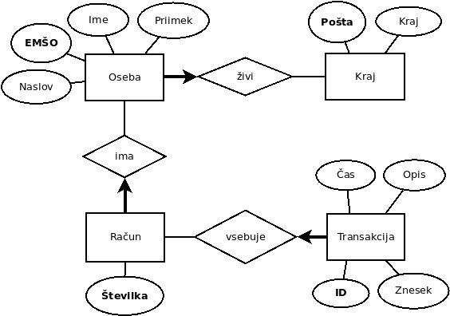

# Podatkovne baze 1 - seminar

---

# `SELECT` - primer

<span class="small">

`Ime` | `Priimek` | `Starost` | `Kraj`
----- | --------- | --------- | ------
Janez | Slovenec  | 42        | Kranj
Ivan  | Slovenec  | 44        | Celje
Peter | Slovenec  | 33        | Kranj
Miha  | Slovenski | 12        | Celje

</span>

```sql
SELECT DISTINCT Kraj FROM t;               -- 2 vrstici
SELECT DISTINCT Priimek, Kraj FROM t;      -- 3 vrstice
SELECT DISTINCT Ime, Priimek, Kraj FROM t; -- 4 vrstice
SELECT Kraj FROM t;                        -- 4 vrstice
SELECT Priimek, Kraj FROM t;               -- 4 vrstice
SELECT Ime, Priimek, Kraj FROM t;          -- 4 vrstice
```

---

# `SELECT` - dodatki

* Vrnjeni stolpci so poljubni izrazi!
  ```sql
  SELECT naslov, ROUND(cena * 1.10, 2) FROM knjige 
   WHERE cena * (1 + davek/100.0) > 100.00;
  ```
* Dodatki
  - `AS`: pre(po)imenujemo izhodni stolpec
  - `ORDER BY`: uredimo vrstice
  - `DISTINCT`: v končnem rezultatu upoštevamo le različne vrstice

---

# Enostavna oblika stavka `SELECT`

<span class="small">

```sql
SELECT * FROM world;

SELECT name, population FROM world;

SELECT name AS "Ime države" FROM world;

SELECT name AS Ime FROM world
 ORDER BY population DESC;

SELECT DISTINCT continent FROM world;

SELECT 2 FROM world WHERE continent = 'Europe';

SELECT population/area FROM world
 WHERE continent IN ('Europe', 'Asia', 'Africa') AND
       area BETWEEN 100000 AND 1000000;

SELECT name FROM world
 WHERE continent = 'Europe'
 ORDER BY population/area;
```

</span>

---

# Poizvedbe s podpoizvedbami

* Izpiši imena evropskih držav, ki imajo manj prebivalcev kot Slovenija.
  ```sql
  SELECT name FROM world
   WHERE population < (
           SELECT population FROM world
            WHERE name = 'Slovenia'
         ) AND
         continent = 'Europe';
  ```
* Ali bomo dobili tudi Slovenijo?

---

# Poizvedbe s podpoizvedbami (2)

* Izpiši imena držav, ki imajo število prebivalcev med številom prebivalcev Alžirije in Kanade.
* Po korakih:
  * ```sql
    SELECT population FROM world
     WHERE name = 'Canada';
    ```
    - Dobimo rezultat *35427524*.
  * ```sql
    SELECT population FROM world
     WHERE name = 'Algeria';
    ```
    - Dobimo rezultat *38700000*.
  * ```sql
    SELECT name FROM world
     WHERE population BETWEEN 35427524 AND 38700000;
    ```

---

# Poizvedbe s podpoizvedbami (3)

```sql
SELECT name FROM world
 WHERE population BETWEEN (
         SELECT population FROM world
          WHERE name = 'Canada'
       ) AND (
         SELECT population FROM world
          WHERE name = 'Algeria'
       );
```

---

# `WITH` (2)

* Navedemo lahko tudi več podpoizvedb in se nanje sklicujemo kot na tabele:
  ```sql
  WITH gospodarji_prstanov AS (
    SELECT * FROM film
     WHERE naslov LIKE 'Gospodar prstanov%'
  ),
  leta_gospodarjev AS (
    SELECT leto FROM gospodarji_prstanov
  ),
  ocene_gospodarjev AS (
    SELECT ocena FROM gospodarji_prstanov
  )
  SELECT * FROM film
   WHERE leto IN leta_gospodarjev AND 
         ocena IN ocene_gospodarjev;
  ```

---

# Velike države

* Poišči tiste države (s pripadajočimi celinami), ki imajo več kot 3x toliko prebivalcev, kot jih imajo ostale države na tej celini.
* Ideja: poiskati maksimalno število prebivalcev med tistimi državami na isti celini (potrebni bosta dve kopiji tabele), ki nimajo istega imena kot ta država.
* ```sql
  SELECT name, continent FROM world AS t1
   WHERE population > (
           SELECT 3 * MAX(population) FROM world AS t2
            WHERE t1.continent = t2.continent AND 
                  t1.name <> t2.name
         );
  ```

---

# `HAVING`

* [Tabela](https://sqlzoo.net/wiki/SELECT_from_Nobel_Tutorial): `nobel(yr, subject, winner)`
* Izpiši tista leta po letu 1970, ko je Nobelovo nagrado iz fizike (*Physics*) dobil le en posameznik.
  ```sql
  SELECT yr FROM nobel 
   WHERE subject = 'Physics' AND
         yr > 1970
   GROUP BY yr  
  HAVING COUNT(yr) = 1;
  ```

---

# `HAVING` (2)

<span class="small">

* Kateri posamezniki so dobili Nobelovo nagrado na dveh ali več področjih?
  ```sql
  SELECT winner, COUNT(subject) FROM nobel
   GROUP BY winner
  HAVING COUNT(subject) > 1;
  ```

  `winner`                                 | `COUNT(subject)`
  ---------------------------------------- | ----------------
  Frederick Sanger                         | 2
  John Bardeen                             | 2
  International Committee of the Red Cross | 3
  Linus Pauling                            | 2
  Marie Curie                              | 2

* Je to v redu?

</span>

---

# Preverimo

* Kako bi dobili še ostale podatke zanje?
  ```sql
  SELECT * FROM nobel
   WHERE winner IN (
           SELECT winner FROM nobel
            GROUP BY winner
           HAVING COUNT(subject) > 1
         );
  ```
* Dejansko smo dobili tiste, ki so dobili Nobelovo nagrado več kot enkrat (ne glede na področje).

---

# Popravimo

* Šteti želimo *različna* področja.
  ```sql
  SELECT winner, COUNT(DISTINCT subject) AS podrocja FROM nobel
   GROUP BY winner
  HAVING COUNT(DISTINCT subject) > 1;
  ```

  <span class="columns" style="--cols: 2;">
  <span>

  `winner`      | `podrocja`
  ------------- | ----------
  Linus Pauling | 2
  Marie Curie   | 2

  </span>
  <span>

  `yr` | `subject` | `winner`
  ---- | --------- | -------------
  1962 | Peace     | Linus Pauling
  1954 | Chemistry | Linus Pauling
  1911 | Chemistry | Marie Curie
  1903 | Physics   | Marie Curie

  </span>
  </span>

---

# Več tabel

* Baza [filmov](https://sqlzoo.net/wiki/More_JOIN_operations) na SQLZoo
  - `movie(id, title, yr, score, votes, director)`
  - `actor(id, name)`
  - `casting(movieid, actorid, ord)`
* Izpiši naslove filmov, kjer je igral *John Wayne*.
* Za naslove potrebujemo tabelo `movie`.
* Imena igralcev so v tabeli `actor`.
* Tabela `casting` povezuje igralce in filme.
  - Odnos tipa več-na-več med tabelama `movie` in `actor` (igralec je igral v več filmih, filmi pa imajo več igralcev)

---

# Stikanje

```sql
SELECT title FROM movie
  JOIN casting ON movie.id = movieid
  JOIN actor   ON actorid = actor.id
 WHERE actor.name = 'John Wayne';
```

* Najprej sestavimo tabelo s stikanjem, nato jo filtriramo z `WHERE`.
  - Vzamemo vrstico tabele `movie`.
  - Staknemo jo s tistimi vrsticami tabele `casting`, ki imajo vrednost v stolpcu `movieid` enako vrednosti stolpca `id` tabele `movie`.
  - Dobljene vrstice staknemo s tistimi vrsticami tabele `actor`, ki imajo vrednost v stolpcu `id` enako vrednosti stolpca `actorid` tabele `casting`.
  - Od dobljenih vrstic vzamemo le tiste, kjer je vrednost stolpca `name` v tabeli `actor` enaka *John Wayne*.

---

# Igralci v filmu Velikan

* Zanima nas, kdo je poleg Jamesa Deana še igral v filmu Velikan (*Giant*).
* Zasedbo dobimo iz tabele `casting`.
  - Tu so le ID-ji filmov in igralcev!
* Potrebujemo ID filma, poznamo pa le njegov naslov, ki se nahaja v tabeli `movie`.
* Imena igralcev bomo dobili iz tabele `actor`.
* Uredili bomo po vrstnem redu igralcev v filmu (`casting.ord`).
  ```sql
  SELECT name FROM movie
    JOIN casting ON movie.id = movieid
    JOIN actor   ON actor.id = actorid
  WHERE title = 'Giant' AND
        name <> 'James Dean'
  ORDER BY ord;
  ```

---

# Največje zvezde

* Kateri igralci so bili glavni igralci v vsaj 10 filmih?
* V tabeli `casting` se pojavijo vsaj desetkrat z `ord = 1`.
  - `WHERE ord = 1`
  - `HAVING COUNT(*) >= 10`
* Imena igralcev bomo dobili iz tabele `actor`.
* Podatkov o filmih ne bomo potrebovali!
  ```sql
  SELECT name FROM actor
    JOIN casting ON actorid = id
   WHERE ord = 1
   GROUP BY id, name
  HAVING COUNT(*) >= 10;
  ```
* Kaj pa, če nas zanima tudi, v koliko filmih so bili glavni igralci?

---

# Glavni igralci

* Zanimajo nas naslovi in glavni igralci vseh tistih filmov, kjer Al Pacino *ni* bil v glavni vlogi.
* Potrebujemo podatke iz vseh treh tabel!
* Zanimajo nas le tiste vrstice, kjer imamo glavnega igralca ...
  - `WHERE ord = 1`
* in to ni *Al Pacino*!
  - `AND name <> 'Al Pacino'`
* Mora pa Al Pacino biti med igralci.
  ```sql
  AND movie.id IN (
    -- seznam ID-jev filmov, kjer je igral Al Pacino
  )
  ```

---

# Seznam filmov z Alom Pacinom

* Potrebujemo tabeli `casting` in `actor`.
* Od filmov potrebujemo samo ID - ta se nahaja v `casting`!
* Zanimajo nas samo vrstice, kjer je igralec *Al Pacino*.
  ```sql
  SELECT movieid FROM casting
    JOIN actor ON actor.id = actorid
   WHERE actor.name = 'Al Pacino';
  ```

---

# Rešitev

```sql
SELECT title, name FROM movie
  JOIN casting ON movie.id = movieid
  JOIN actor   ON actor.id = actorid
 WHERE ord = 1 AND
       name <> 'Al Pacino' AND
       movie.id IN (
         SELECT movieid FROM casting
           JOIN actor ON actor.id = actorid
          WHERE actor.name = 'Al Pacino'
    );
 
```

---

# Vrstni red izvajanja

```sql
SELECT [DISTINCT]                       -- 8
    stolpci, združevalne_funkcije       -- 7
  FROM leva_tabela                      -- 1
[LEFT] JOIN                             -- 3
       desna_tabela ON pogoji_stikanja  -- 2
 WHERE vsebinski_pogoji                 -- 4
 GROUP BY ključi_skupin                 -- 5
HAVING pogoji_skupin                    -- 6
 ORDER BY ključi_urejanja               -- 9
 LIMIT število;                         -- 10
```

---

# Primer

<span class="small">

* Imamo tabeli `narocnik` in `narocilo`.

  <span class="columns small" style="--cols: 2;">
  <span>

  `narocnik_id` | `ime`  | `priimek`
  ------------- | ------ | ---------
  1             | Damjan | Kmetec
  2             | Aljaž  | Kmetec
  3             | Špela  | Prezelj
  4             | Metka  | Kmetec
  
  </span>
  <span>

  `narocilo_id` | `narocnik_id` | `kolicina`
  ------------- | ------------- | ----------
  1             | 1             | 2
  2             | 1             | 1
  3             | 3             | 1
  4             | 4             | 4

  </span>
  </span>

* Želimo dobiti število naročil vsakega naročnika s priimkom *Kmetec*, ki je naročil največ tri kose, urejeno naraščajoče po številu naročil.

  <span class="small">

  `narocnik_id` | `ime`  | `priimek` | `stevilo` | `skupna_kolicina`
  ------------- | ------ | --------- | --------- | -----------------
  2             | Aljaž  | Kmetec    | 0         | 0
  1             | Damjan | Kmetec    | 2         | 3

  </span>

</span>

---

# Poizvedba

```sql
SELECT narocnik_id, ime, priimek,
         COUNT(narocilo_id) AS stevilo,
         COALESCE(SUM(kolicina), 0) AS skupna_kolicina
  FROM narocnik
  LEFT OUTER JOIN
       narocilo USING (narocnik_id)
 WHERE priimek = 'Kmetec'
 GROUP BY narocnik_id, ime, priimek
HAVING COALESCE(SUM(kolicina), 0) <= 3
 ORDER BY stevilo;
```

---

# Stikanje

```sql
...
FROM narocnik LEFT OUTER JOIN narocilo USING (narocnik_id)
...
```
<span class="small">

`narocnik_id` | `ime`  | `priimek` | `narocilo_id` | `kolicina`
------------- | ------ | --------- | ------------- | ----------
1             | Damjan | Kmetec    | 1             | 2
1             | Damjan | Kmetec    | 2             | 1
2             | Aljaž  | Kmetec    | `NULL`        | `NULL`
3             | Špela  | Prezelj   | 3             | 1
4             | Metka  | Kmetec    | 4             | 4

</span>

---

# Filtriranje

```sql
...
WHERE priimek = 'Kmetec'
...
```
<span class="small">

`narocnik_id` | `ime`  | `priimek` | `narocilo_id` | `kolicina`
------------- | ------ | --------- | ------------- | ----------
1             | Damjan | Kmetec    | 1             | 2
1             | Damjan | Kmetec    | 2             | 1
2             | Aljaž  | Kmetec    | `NULL`        | `NULL`
4             | Metka  | Kmetec    | 4             | 4

</span>

---

# Združevanje

```sql
...
GROUP BY narocnik_id, ime, priimek
...
```
<span class="small">

`narocnik_id` | `ime`  | `priimek` | `narocilo_id` | `kolicina`
------------- | ------ | --------- | ------------- | ----------
1             | Damjan | Kmetec    | 1             | 2
&nbsp;        | &nbsp; | &nbsp;    | 2             | 1
2             | Aljaž  | Kmetec    | `NULL`        | `NULL`
4             | Metka  | Kmetec    | 4             | 4

</span>

---

# Filtriranje skupin

```sql
...
HAVING COALESCE(SUM(kolicina), 0) <= 3
...
```

<span class="small">

`narocnik_id` | `ime`      | `priimek`  | `narocilo_id` | `kolicina` | `skupna_kolicina`
------------- | ---------- | ---------- | ------------- | ---------- | -----------------
1             | Damjan     | Kmetec     | 1             | 2          | 3
&nbsp;        | &nbsp;     | &nbsp;     | 2             | 1
2             | Aljaž      | Kmetec     | `NULL`        | `NULL`     | 0
~~4~~         | ~~Metka~~  | ~~Kmetec~~ | 4             | 4          | 4

</span>

---

# Izračun stolpcev

```sql
SELECT narocnik_id, ime, priimek,
         COUNT(narocilo_id) AS stevilo,
         COALESCE(SUM(kolicina), 0) AS skupna_kolicina
...
```

`narocnik_id` | `ime`  | `priimek` | `stevilo` | `skupna_kolicina`
------------- | ------ | --------- | --------- | -----------------
1             | Damjan | Kmetec    | 2         | 3
2             | Aljaž  | Kmetec    | 0         | 0


---

# Urejanje

```sql
...
 ORDER BY stevilo;
```

`narocnik_id` | `ime`  | `priimek` | `stevilo` | `skupna_kolicina`
------------- | ------ | --------- | --------- | -----------------
2             | Aljaž  | Kmetec    | 0         | 0
1             | Damjan | Kmetec    | 2         | 3

---

# Še nekaj primerov

* Baza filmov (SQLite)
* V katerih žanrih je posnetih največ filmov?
* Podatki v tabeli `pripada` - film ima lahko več žanrov!
* Imena žanrov so v tabeli `zanr`.
* ```sql
  SELECT naziv, COUNT(*) AS stevilo
    FROM pripada
    JOIN zanr ON zanr = id
   GROUP BY id, naziv
   ORDER BY stevilo DESC;
  ```

---

# Povprečna ocena in dolžina po žanrih

* Ocene in dolžine so v tabeli `film`.
* ```sql
  SELECT naziv,
         AVG(ocena) AS povprecna_ocena,
         AVG(dolzina) AS povprecna_dolzina
    FROM film
    JOIN pripada ON film.id = film
    JOIN zanr ON zanr = zanr.id
   GROUP BY zanr.id, naziv
   ORDER BY povprecna_ocena DESC;
  ```

---

# Filmi z več kot enim režiserjem

<span class="small">

```sql
SELECT naslov, COUNT(*) AS st_reziserjev
  FROM vloga
  JOIN film ON film = id
 WHERE tip = 'R'
 GROUP BY naslov
HAVING st_reziserjev > 1
 ORDER BY st_reziserjev DESC;
```

* Zakaj je to narobe?
* Pravilno:
  ```sql
  SELECT naslov, COUNT(*) AS st_reziserjev
    FROM vloga
    JOIN film ON film = id
  WHERE tip = 'R'
  GROUP BY id, naslov
  HAVING st_reziserjev > 1
  ORDER BY st_reziserjev DESC;
  ```

</span>

---

# Romantične komedije

* Zanimajo nas filmi, ki imajo med žanri *Comedy* in *Romance*.
* Poskusimo:
  ```sql
  SELECT film FROM pripada
   WHERE zanr = 4 AND zanr = 8;
  ```
  - Zakaj to ni OK?
* Želimo tiste filme, za katere obstaja tako vrstica z `zanr = 4` kot tudi z `zanr = 8`!

---

# Romantične komedije (2)

* Dobimo ID-je vseh filmov, za katere se pojavita oba žanra.
  ```sql
  SELECT film FROM pripada
    JOIN zanr ON zanr = id
   WHERE naziv IN ('Comedy', 'Romance')
   GROUP BY film
  HAVING COUNT(*) = 2;
  ```
* Lahko bi uporabili kot podpoizvedbo, ali pa staknemo zraven še tabelo `filmi`.
  ```sql
  SELECT naslov FROM film
    JOIN pripada ON film.id = film
    JOIN zanr ON zanr = zanr.id
   WHERE naziv IN ('Comedy', 'Romance')
   GROUP BY film.id, naslov
  HAVING COUNT(*) = 2;
  ```

---

# Igralec in režiser v istem filmu

```sql
SELECT naslov, ime FROM film
  JOIN vloga ON film.id = film
  JOIN oseba ON oseba = oseba.id
 GROUP BY film.id, naslov, oseba.id, ime
HAVING COUNT(*) = 2;
```

* Deluje, ker sta edini vlogi igralec in režiser.
* Kaj pa, če bi lahko imeli več vlog, pa nas vseeno zanimata samo ti dve?
* Ali pa če se nekdo večkrat pojavi kot igralec (npr. več likov v istem filmu)?

---

# Igralec in režiser v istem filmu (2)

```sql
WITH reziser AS (
       SELECT * FROM vloga
        WHERE tip = 'R'
     ),
     igralec AS (
       SELECT * FROM vloga
        WHERE tip = 'I'
     )
SELECT naslov, ime FROM reziser
  JOIN igralec USING (oseba, film)
  JOIN film ON film.id = film
  JOIN oseba ON oseba.id = oseba;
```

---

# Kaj počne ta poizvedba?

```sql
SELECT film.*
  FROM pripada AS prvi
  JOIN pripada AS drugi USING (film)
  JOIN film ON id = film
 WHERE prvi.zanr = 4 AND
       drugi.zanr = 8 AND
       oznaka <> 'R'
 ORDER BY film.glasovi DESC;
```

---

# Primer ER diagrama - šola


---

# Primer ER diagrama - knjižnica


* Kakšne so težave s tem modelom?

---

# Primer načrtovanja baze: banka

* Hraniti želimo podatke o komitentih banke ter njihovih računih in transakcijah.
  - Za komitenta hranimo EMŠO, ime, priimek in naslov.
  - Vsak komitent ima lahko več računov.
  - Za vsako transakcijo na nekem računu beležimo znesek, čas in neobvezen opis.

---

# Konceptualni model



---

# Logični model (SQLite)

<span class="columns small" style="--cols: 2;">
<span>

```sql
CREATE TABLE kraj (
  posta    integer PRIMARY KEY,
  kraj     text    NOT NULL
);

CREATE TABLE oseba (
  emso     text    PRIMARY KEY,
  ime      text    NOT NULL,
  priimek  text    NOT NULL,
  ulica    text    NOT NULL,
  posta    integer NOT NULL
             REFERENCES kraj(posta)
);
```

</span>
<span>

```sql
CREATE TABLE racun (
  stevilka integer PRIMARY KEY
                   AUTOINCREMENT,
  lastnik  text    NOT NULL
             REFERENCES oseba(emso)
);

CREATE TABLE transakcija (
  id       integer   PRIMARY KEY
                     AUTOINCREMENT,
  racun    integer   NOT NULL
             REFERENCES racun(stevilka),
  znesek   integer   NOT NULL, 
  cas      timestamp NOT NULL
             DEFAULT CURRENT_TIMESTAMP,
  opis     text
);
```

</span>
</span>

---

# Kako deluje internet

<span class="small">

* Internet je v osnovi ogromno omrežje, v katerega so povezani računalniki (in ostale naprave).
* Lahko si ga predstavljamo kot graf.
  - Posamezni računalniki so listi tega grafa.
  - Vmesna vozlišča so usmerjevalniki.
* Če se želita dva računalnika pogovarjati, je potrebno poiskati pot v tem grafu.
  - Za iskanje učinkovitih poti skrbijo usmerjevalniki.
* Vsaka naprava na internetu ima svoj naslov.
  ```
  $ host www.google.com
  www.google.com has address 142.250.186.68
  www.google.com has IPv6 address 2a00:1450:400d:80e::2004
  ```
  - Vsaka naprava lahko uporablja naslova 127.0.0.1 (IPv4) ali ::1 (IPv6) za sklicevanje nase.

</span>

---

# DNS - *Domain Name System*

<span class="small">

* Za lažjo uporabo napravam v omrežju dodelimo hierarhično organizirana imena.
* Primer: `www.google.com`
  - Vrhnja domena: `com` (ali `net`, `org`, ..., ter državne domene, kot `si`, ...)
  - Organizacija (znotraj `com`): `google`
  - Naprava (znotraj `google.com`): `www`
* Naslove, ki ustrezajo imenom, hranijo hierarhično organizirani imenski strežniki.
* Ko se želimo povezavi na `www.google.com`, pošljemo poizvedbo imenskemu strežniku internetnega ponudnika.
  - Če odgovora ne pozna, povpraša vrhnji strežnik, nato strežnik za `com`, nazadnje še strežnik za `google.com`.
* Ime `localhost` ustreza naslovoma 127.0.0.1 in ::1.

</span>

---

# Protokoli in vrata

* Za pošiljanje podatkov med računalniki se uporabljata omrežna protokola IPv4 in IPv6 (*Internet Protocol*, različici 4 in 6).
* Na posamezni napravi lahko teče več aplikacij, vsaka uporablja določena *vrata* pri enem od transportnih protokolov.
  - UDP (*User Datagram Protocol*) - za DNS, IPTV, IP telefonijo, ...
  - TCP (*Transmission Control Protocol*) - za večino storitev
* Številke vrat so večinoma standardizirane:
  - 53/UDP: DNS
  - 80/TCP: HTTP (*Hypertext Transfer Protocol*)
  - 443/TCP: HTTPS (HTTP preko SSL/TLS - šifrirana povezava)

---

# Kaj se zgodi, ko v brskalnik vtipkamo `https://www.google.com/`

* Operacijski sistem pošlje zahtevo imenskemu strežniku po protokolu DNS za IP naslov, ki ustreza imenu `www.google.com`.
  - Odgovor si zapomni, da ni potrebno vsakič spraševati.
* Z računalnikom na dobljenem naslovu poskusi vzpostaviti sejo TCP na vratih 443.
  - Seja TCP skrbi za zanesljiv prenos podatkov.
* Po vzpostavljeni seji se vzpostavi šifriran kanal po protokolu SSL/TLS.
* Brskalnik ima sedaj na voljo povezavo s spletnim strežnikom, s katerim se pogovarja po protokolu HTTP.
