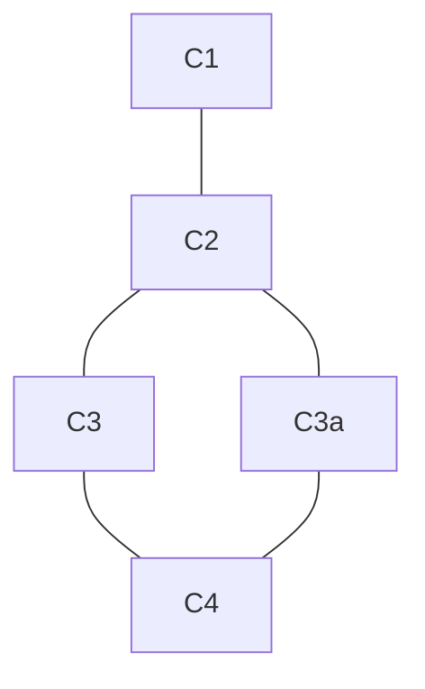

# Podatkovne baze 1 - vaje 12.10.2020

---

## GitHub & VS Code

* Prijavimo se na [GitHub](https://github.com) in ustvarimo repozitorij
* Damo pravico pisanja sošolcu
* Repozitorij uvozimo v VS Code



### Repozitoriji

* Janoš Vidali: <https://github.com/jaanos/podatkovne-baze-1>
* Luka Šešet: <https://github.com/ZacetekVaj/PodatkovneBaze>
* Tamara Pogačar: <https://github.com/TPogacar/podatkovne_baze_1>
* Denis Benčič: <https://github.com/DenisBencic/PB1>
* Marej Čušin: <https://github.com/CusinM15/PB1>
* Andrej Treven in Peter Rotar: <https://github.com/SmokeyAjax/Chad-baze-1>
* Martin Ogrin (in Miha Petek): <https://github.com/StonyTark/PB1-projekt>
* Saša Ošlaj: <https://github.com/SashaOslaj/Projekt-pri-podatkovnih-bazah-1>
* Tina Savarin: <https://github.com/TinaKrasovec/PB1>
* Hana Kranjec Kelbel: <https://github.com/hanaKel/pb-1>
* David Adamič: <https://github.com/DavidAdamic/Podatkovne-baze-1>

## SQLiteStudio

* Če ga še nimamo, si naložimo [SQLiteStudio](https://sqlitestudio.pl/)
    - lahko izberemo tudi [različico za nameščanje](https://github.com/pawelsalawa/sqlitestudio/releases) za ustrezni sistem
* S spletne učilnice poberemo [bazo filmov](https://ucilnica.fmf.uni-lj.si/mod/resource/view.php?id=33636) in jo naložimo v SQLiteStudio

## Osnovne poizvedbe

```sql
SELECT *, stolpci, st1+st2
FROM tabela
WHERE (stolpec LIKE 'niz%' AND st2 = st3) OR st1+4 >= st2*3
ORDER BY stolpec DESC, st2 ASC, st3
LIMIT stevilo;
```

1. Izpiši vse filme iz leta 1950.

   ```sql
   SELECT *
   FROM film
   WHERE leto = 1950;
   ```

2. Izpiši imena vseh žanrov.

   ```sql
   SELECT naziv FROM zanr;
   ```

3. Izpiši imena prvih 10 oseb v abecednem vrstnem redu.

   ```sql
   SELECT ime FROM oseba
   ORDER BY ime ASC
   LIMIT 10;
   ```
