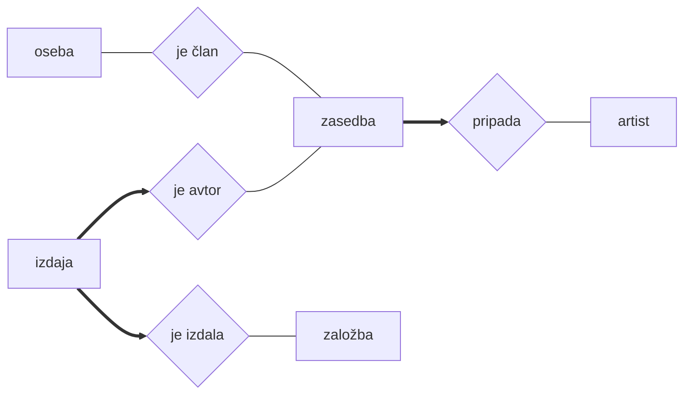

# Podatkovne baze 1 - vaje 23.11.2020

---

## Baza Ekol


- vsaka entiteta naj ima ustrezen ključ (če nič drugega, ID)
- premislita, ali naj bosta povzročitelj in prejemnik referenci na entiteto *podjetje*
- dodajta entiteto *vrsta* z ustreznimi atributi

```sql
CREATE TABLE podjetje (
  id INTEGER PRIMARY KEY AUTOINCREMENT,
  ime TEXT NOT NULL,
  naslov TEXT NOT NULL,
  ...
);

CREATE TABLE vrsta (
  klasifikacijska_stevilka VARCHAR(9) PRIMARY KEY CHECK (klasifikacijska_stevilka LIKE '__ __ __%'),
  naziv TEXT NOT NULL UNIQUE
);

CREATE TABLE skladisce (
  id INTEGER PRIMARY KEY AUTOINCREMENT,
  ime TEXT NOT NULL
);

CREATE TABLE odpadek (
  id INTEGER PRIMARY KEY AUTOINCREMENT,
  teza INTEGER NOT NULL,
  povzrocitelj INTEGER NOT NULL REFERENCES podjetje(id),
  prejemnik INTEGER REFERENCES podjetje(id) -- če ni obvezen podatek, brez NOT NULL
  datum_uvoza DATE NOT NULL,
  opomba_uvoz TEXT,
  datum_izvoza DATE,
  opomba_izvoz TEXT,
  vrsta VARCHAR(9) NOT NULL REFERENCES vrsta(klasifikacijska_stevilka),
  skladisce INTEGER REFERENCES skladisce(id)
);
```

## Generator filmov


```sql
CREATE TABLE zvezdnik (
  idZvezdnik INT PRIMARY KEY AUTO_INCREMENT,
  ime TEXT NOT NULL,
  letoRojstva YEAR NOT NULL,
  letoSmrti YEAR
);

CREATE TABLE naslov (
  idNaslov INT PRIMARY KEY AUTO_INCREMENT,
  glavniNaslov TEXT NOT NULL,
  ...
);

CREATE TABLE vloga (
  idVloga INT PRIMARY KEY AUTO_INCREMENT,
  idZvezdnik INT REFERENCES zvezdnik(idZvezdnik),
  idNaslov INT REFERENCES naslov(idNaslov),
  igranaOseba TEXT NOT NULL
);

CREATE TABLE tipZaposlitve (
  idZaposlitve INT PRIMARY KEY AUTO_INCREMENT,
  imeZaposlitve TEXT NOT NULL UNIQUE,
  kategorija TEXT NOT NULL
)

CREATE TABLE zaposlitev (
  idZvezdnik INT REFERENCES zvezdnik(idZvezdnik),
  idNaslov INT REFERENCES naslov(idNaslov),
  tip INT REFERENCES tipZaposlitve(idZaposlitve),
  PRIMARY KEY (idZvezdnik, idNaslov, tip)
);
```

## Slovenske fakultete


- ID-ji pri entitetah
- entiteta za prostor na fakulteti in relacija iz izpita
- dve dvomestni relaciji za predmet namesto trimestne
- izpeljani atributi ne sodijo v bazo!

```sql
CREATE TABLE program (
  id INTEGER PRIMARY KEY AUTOINCREMENT,
  tip TEXT NOT NULL CHECK (tip IN ('redni', 'izredni')),
  ...
);
```

## Baza video iger


```sql
CREATE TABLE podjetje (
  id INTEGER PRIMARY KEY AUTOINCREMENT,
  ime TEXT NOT NULL,
  ustanovitev DATE,
  drzava TEXT,
  opis TEXT
);

CREATE TABLE razvijalec (
  id INTEGER PRIMARY KEY REFERENCES podjetje(id)
);

CREATE TABLE distributer (
  id INTEGER PRIMARY KEY REFERENCES podjetje(id)
);

CREATE TABLE igra (
  id_igre INTEGER PRIMARY KEY AUTOINCREMENT,
  ime TEXT NOT NULL,
  ...
  razvija INTEGER NOT NULL REFERENCES razvijalec(id)
);

CREATE TABLE distribuira (
  id_distributerja INTEGER REFERENCES distributer(id),
  id_igre INTEGER REFERENCES igra(id_igre),
  PRIMARY KEY (id_distributerja, id_igre)
);
```

## Glasbena baza




## Olimpijske igre


## League of Legends

